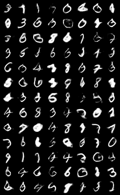
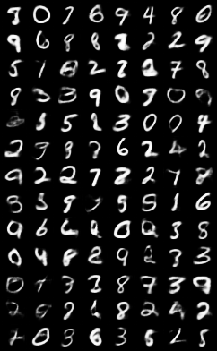

## Introduction
This is the implementation of [Wasserstein Auto-Encoders](https://arxiv.org/abs/1711.01558) paper in PyTorch.

I rewrite the model in DC-GAN for the encoder/decoder/discriminator instead of simple MLP

## Requirement
* python 3
* PyTorch >= 0.4
* torchvision
* numpy
* tqdm

## Train
* To train a WAE-GAN:
```
python wae_gan.py
```
* To train a WAE-MMD:
```
python wae_mmd.py
```

## Randomly Generated Images (100 Epochs)
* WAE-MMD


* WAE-GAN
